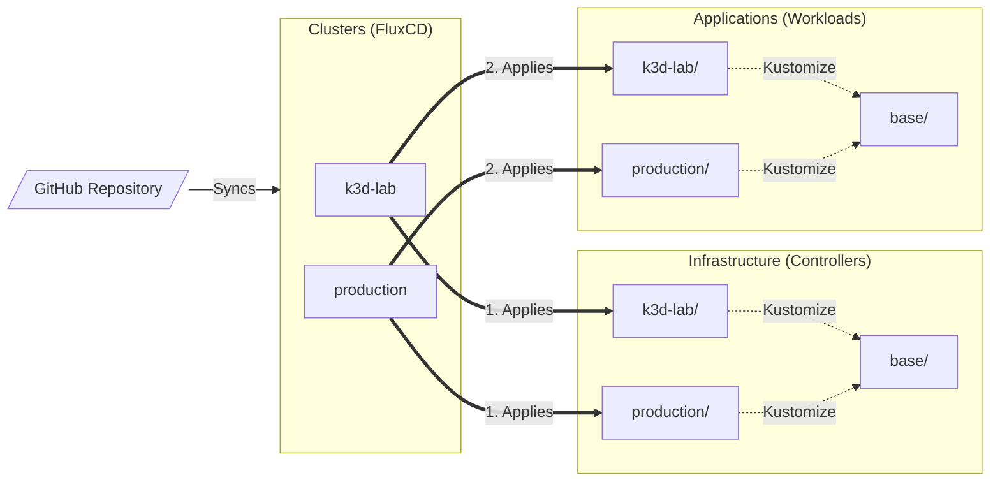
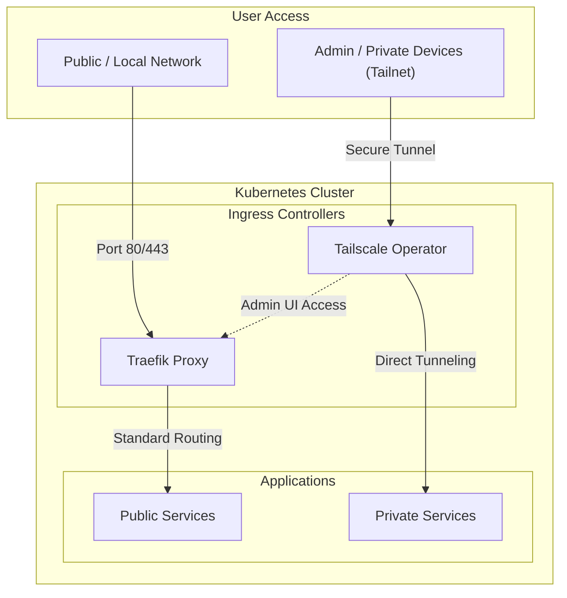

# Homelab Infrastructure

This org contains all configurations for my homelab as it is provisioning the base infrastructure via [Terraform](https://developer.hashicorp.com/terraform) and deploying workloads via [FluxCD](https://fluxcd.io/).

## GitOps Architecture

The cluster state is entirely declarative and managed by FluxCD, utilizing Kustomize for base and environment-specific overlays.

## Hybrid Access Strategy

We use a dual-layer security model to balance accessibility and high-level protection.

## FAQ

**Why use a dedicated GitHub Organization for a homelab?**

Creating a separate GitHub organization rather than using a personal user account makes network management significantly easier. By tying the organization to [Tailscale](https://tailscale.com), the homelab infrastructure gets its own completely isolated [tailnet](https://tailscale.com/docs/concepts/tailnet).
