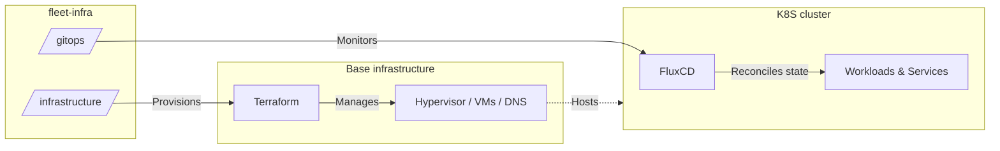

# My homelab

This organization centralizes the configuration and codebase for my homelab. The environment is entirely declarative, managed through IaC and GitOps.

## High-Level architecture

The infrastructure is split into two primary layers: hardware/network provisioning and cluster state management.

## Organization Structure

The repositories in this organization are structured by their operational scope:

- `infrastructure`: Contains Terraform states and modules to provision the underlying infrastructure (VMs, DNS records, Tailscale ACLs).
- `gitops`: The source of truth for the Kubernetes cluster. FluxCD monitors this repository to deploy ingress controllers, base services, and user applications using Kustomize and Helm.

_(Note: Detailed architectures, network routings, and deployment structures are documented within their respective repositories.)_

## FAQ

- Why use a dedicated GitHub Organization for a homelab?

Creating a separate GitHub organization rather than using a personal user account makes network management significantly easier and more secure.

By tying this organization to [Tailscale](https://tailscale.com), the homelab infrastructure gets its own completely isolated [tailnet](https://tailscale.com/docs/concepts/tailnet). This provides:

- Strict Network Isolation: Clearly separates personal devices from infrastructure servers and services.
- Better Security & ACLs: Dedicated access control lists, authentication keys, and network tags exclusively for the homelab environment.
- Clean Access Management: GitHub Organization teams and members can be mapped directly to Tailscale access roles.
